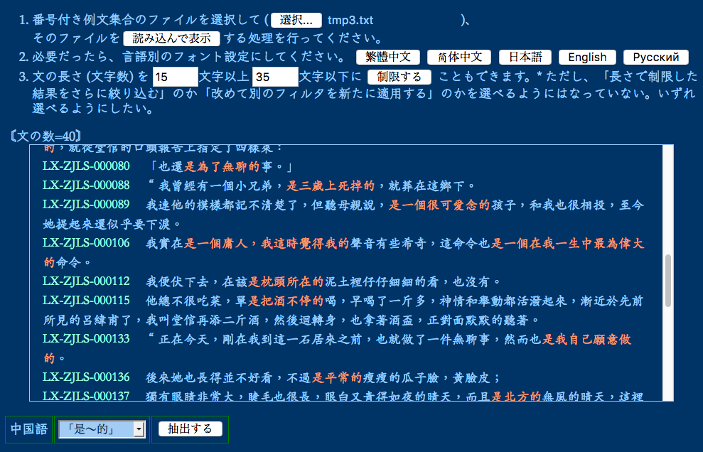

# Get tailored example sentences! / 自分に合わせた例文がほしいよね!

When you learn a foreign language, you may think "I cannot be interested in this example sentence because the situation where this sentence is applicable is completely irrelevant to me!".  The tools in this repository may help you select sentences from a text work (e.g., a novel, an article, etc.) you are interested in, as example sentences to be used for your learning.

外国語学習の際に、「この例文が該当する状況なんて、自分にはこれっぽっちも関係のない世界だし、こんな例文じゃ、まったく興味が持てないよぉ」とお嘆きの皆さん!
このレポジトリにあるツールは、自分が興味を持っている文書 (小説とか記事とか) から、学習用に使う例文として、文を選ぶのを手助けします。

# Conditions / 状況・条件

There are some prototype tools only.  Some of them require bash and Perl, the others can run on a Web browser.

まだプロトタイプのツールがいくつかできているだけです。一部は bash と Perl を要しますが、その他のものはブラウザ上で動きます。

# How do I get example sentences tailored for me? / どうやって自分向けの例文を取得するの?

## (1) Getting a original text work / 元になるテキストを取得する

For example, you might find your interested text work at a page(s) of [Wikisource](https://en.wikisource.org) in the language that you want to learn.  You can copy the text body and paste it to an empty plain text file, for example, `orig.txt`.

たとえば、自分が学習したい言語の[ウィキソース](https://ja.wikisource.org)から、興味のある文書をコピーして、テキストファイル (たとえば `orig.txt`) にペーストします。

## (2) Preprocessing (and optional manual correction) / 前処理 (と、任意で手作業での修正)

Prepare a new file (e.g., `split.txt`) in which each line basically correspond to one sentence.  This may be done by running the script as follows, if the target language is Chinese or Japanese.  For details of available options, please see the script.

概ね一文ごとに改行されるようにしたファイル (たとえば `split.txt`) を作ります。中国語・日本語なら下記のスクリプトが使えると思います (オプションについてはスクリプトを参照)。

````
$ preproc/split_into_sentences_01.pl < orig.txt > split.txt
````

If the target language is one of those languages that put whitespace characters between words, please use `split_into_sentences_02.pl` instead of `split_into_sentences_01.pl`.

単語間に空白を置く言語なら、`split_into_sentences_01.pl` ではなく `split_into_sentences_02.pl` を使ってください。

In addition, you may need to manually correct `split.txt` because the script may fail to perfectly format the input file.

スクリプトは、文への分割が完璧にできるわけではないので、手作業で `split.txt` を多少修正する必要もあるかと思います。

After that, assign ID numbers to the sentences in `split.txt` by running the script as follows.  For details of available options, please see the script.

それから、以下のスクリプトを実行して、`split.txt` 中の文に番号を振ります (オプションについてはスクリプトを参照)。

````
$ preproc/numbering.pl < split.txt > formatted.txt
````

## (3) Applying one or more filters / フィルタにかける

There are a small number of filters targetted to Chinese language.

中国語用の少数のフィルタしか、まだできていません。

Command line-based filters all use standard input/output, and thus, they can be pipelined as follows, for example. 

コマンドライン版のフィルタは、どれも標準入出力を使うようにしてあるので、たとえば下記のようにパイプでつなげられます。

````
$ filter/constrain_char_len.pl -min 5 -max 20 < formatted.txt | filter/zh/numerical.sh
````

You may also use browser-based filters via `browser_ver/filter_test.html`, although the user interface of this HTML file is currently writtern in Japanese only.

`browser_ver/filter_test.html` を介してブラウザ版のフィルタを使うこともできます。

The following image indicates an example where browser-based filters are applied to a file that has been created by obtaining the text data of the novel titled "在酒樓上" written by 魯迅 (Luxun), from [Wikisource](https://zh.wikisource.org/wiki/%E5%9C%A8%E9%85%92%E6%A8%93%E4%B8%8A),  preprocessing the data, manually correcting it, and assigning IDs to the sentencess.

以下は、魯迅の「在酒樓上」という小説のテキストデータを[Wikisource](https://zh.wikisource.org/wiki/%E5%9C%A8%E9%85%92%E6%A8%93%E4%B8%8A)から取得して加工し、ブラウザ版のフィルタを使っている例です。



## (4) Adding your filters as you need / 自分の必要に応じてフィルタを追加

As you will see in `filter/zh/*.sh` and `browser_ver/zh_filters.js`, only simple filters based on regular expressions are used.  It will be easy to add new filters as you like.

`filter/zh/*.sh` や `browser_ver/zh_filters.js` のとおり、単純な正規表現フィルタを使っているだけなので、自分用のフィルタを追加するのは簡単だと思います。

=== End (終わり) ===
